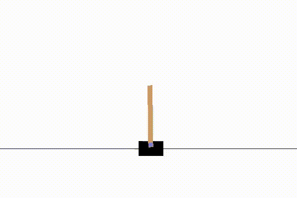
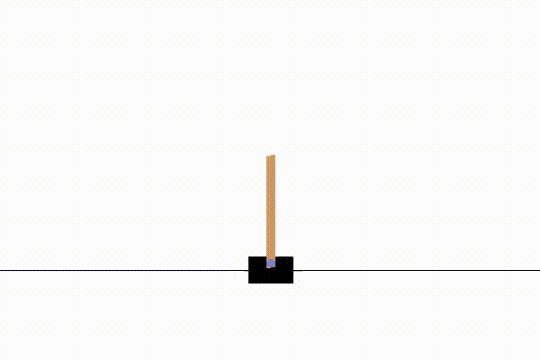
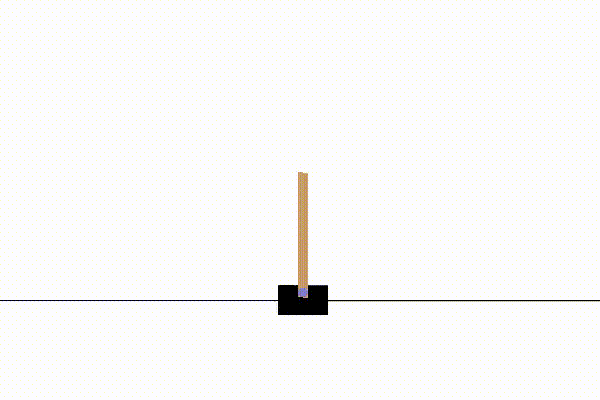

# Reinforcement-Learning

Active Reinforcement Q-Learning with OpenAI Gym

## Requirements

```txt
Python 3
numpy
gym
matplotlib
scikit-learn
```

## Setup

This environment is provided by OpenAI Gym as "CartPole-v0".  

- There are 2 possible discrete actions in the `action_space`: left (0) and right (1).  
- Each action the cart makes returns 4 values: `cartPosition, cartVelocity, poleAngle, poleVelocity`  
- The goal of this AI is to remain upright for as long as possible. If it remains upright for over 195 frames then it is considered successful.  

## Methodology

Train for 300 episodes. While the AI has not fallen down...

- The most important task is to convert a continuous state space into a discrete state space so that we can get the `current_state` at a point in time. This done by using sklearn's KBinsDiscretizer. PoleAngle is discretized into 6 buckets and PoleVelocity is discretized into 12 buckets. We ignore cartPosition and cartVelocity because we only care if the pole is falling down.
- Select a random float from 0 to 1. If the random float is less than the exploration rate, then the AI explores by choosing a random action from the `action_space`. The AI explores very often early on and less later on as the exploration rate decays.  
- Otherwise, use a greedy policy to select an action from the QTable given the AI's current state. This greedy policy selects the indices of the maximum values in the QTable and tells the cart whether to move left or right given the `current_state`. This greedy approach may or may not have a good reward; it's simply chosen for the sake of fast learning. As the QTable evolves, this greedy approach should pay off since the AI will find states which keep the cart upright.
- Get the new learning rate which is a decaying number from 1.0 to 0.001.
- Get the new Q-value by measuring if the action taken was worth it or not. "Worth" can be thought of as the future expected reward. Slowly, the Q-table is updated such that the AI knows which states are worth the investment.
- Update the Q-table by applying the dynamic learning rate.
- Store the number of actions to reach the goal into a list `samples`.
- Plot the `samples`.

## Results

```txt
Finished training episode: 50
Finished training episode: 100
Finished training episode: 150
Finished training episode: 200
Finished training episode: 250
Finished training episode: 300
```

### Cartpole Training Performance


### Episode 150



### Episode 300



### Episode 500



---

## Custom Environment

Implement an escape room maze as a custom environment in OpenAI Gym.  

    

- There are 6 possible discrete actions in the `action_space`: Rooms 0, 1, 2, 3, 4, 5
- The lowest observation value is 0 and the highest observation value is 5.  
- The starting state (room) is 2.  
- The environment is hardcoded as a graph. If an action has a neighbor node on the graph (given the current state), then the action becomes the next state. Reward the AI with +1. Otherwise, if the action is invalid (does not have a neighbor given the current state), then do not move. Penalize the AI with -1.
- If the current state is ever 5, then you have reached the goal and make `done = True`.

## Methodology (Same as Above)

Train for 300 episodes. While the AI has not reached the goal (room 5)...

- Select a random float from 0 to 1. If the random float is less than the exploration rate, then select an action from the discrete action space.
- The AI explores less early on (because it is still learning), but later on, it may take random jumps.
- Otherwise, explore by using a greedy policy to select an action from the QTable given the AI's current state.
- Get the new learning rate which is a decaying number from 1.0 to 0.001.
- Get the new Q-value by measuring if the action taken was worth it or not. "Worth" can be thought of as the future expected reward. Slowly, the Q-table is updated such that the AI knows which states are worth the investment.
- Update the Q-table by applying the dynamic learning rate.
- Store the number of actions to reach the goal into a list `samples`.
- Plot the `samples`.

Adjust the `discount_value` (aka. epsilon) from 0.99 to 0.95 for faster convergence.

```txt
Finished training episode: 50
Finished training episode: 100
Finished training episode: 150
Finished training episode: 200
Finished training episode: 250
Finished training episode: 300
Actions to take: [3, 1, 5]
Lowest number of actions to complete maze: 3
```

